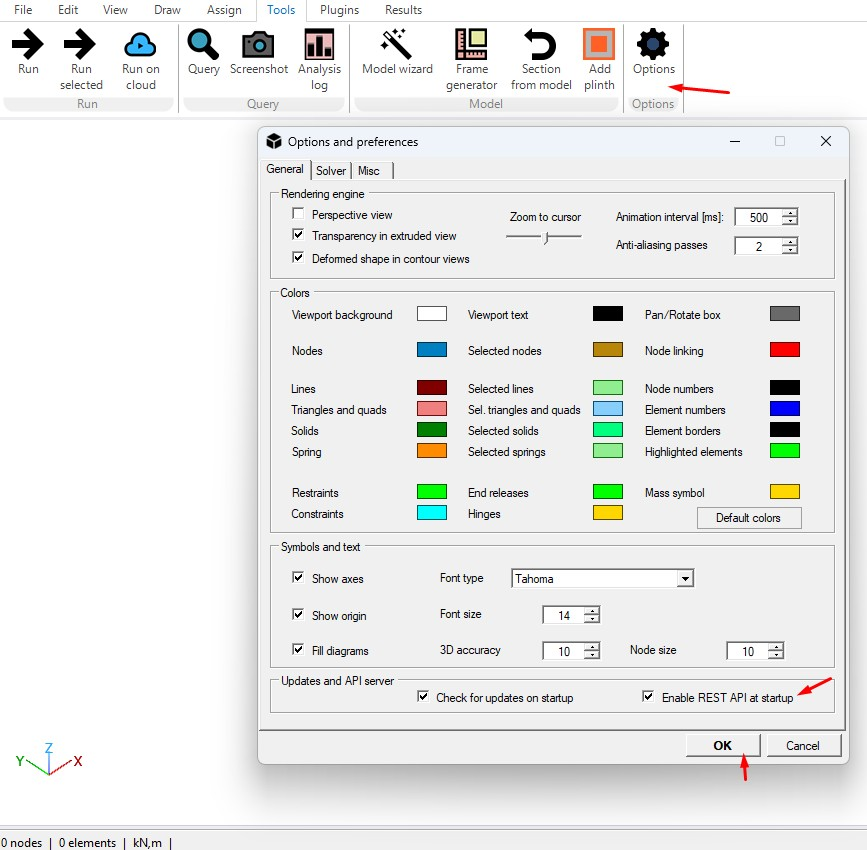
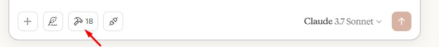

# MCPserver

MCP server for AI chat

This guide will show you how to implement a local MCP server for [Anthropic Claude](https://www.anthropic.com/claude) AI.
MCP server is a simple interface that allows you to connect your local NextFEM Designer installation to Claude AI.

#### Installation

Install [Claude Desktop](https://claude.ai/download).

NextFEM Designer is supposed to be already installed on your system. Be sure to activate the REST server at startup of the program, by activating the option depicted below.




#### Configuration of MCP Server

MCP server consists in a Python script exposing the tools to be connected with AI. This is supplied by your public repository MCPserver.

1. Clone the repo with:
   `git pull https://github.com/NextFEM/MCPserver.git`
2. From the command shell, navigate to the newly created folder. To install required packages:
   `pip install -r requirements.txt`
3. Configure Claude Desktop to load MCP server at startup. Change it to:

```json
{
    "mcpServers": {
        "NextFEM": {
            "command": "python",
            "args": [
                "C:\\myPath\\mcpServer.py"
            ]
        }
    }
}
```

Remember to change myPath with the MCP server path.

That’s all. Restart NextFEM Designer and Claude Desktop. You’ll see a
hammer with the number of NextFEM Designer tools avaialble in Claude.

